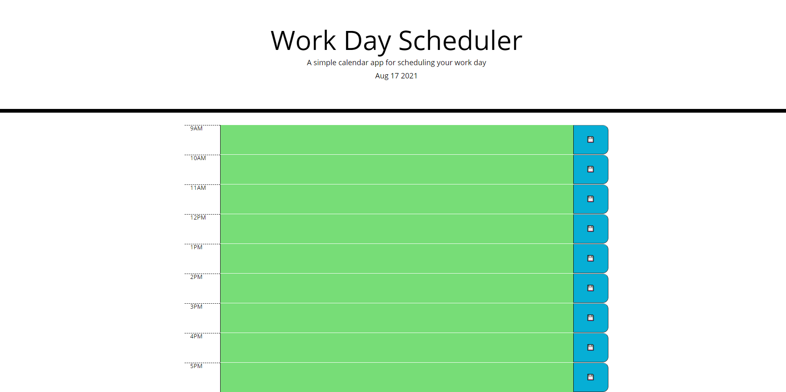

<br>
<p align="center">
   <h2 align="center">Scheduling Day Planner</h2>
</p>
<br>

## About the project
This is a day planner for organizing tasks throughout the day with the ability to reload the page with all of the listed tasks staying on the page next time they are referenced. Using jQuery and Moment.js, this page compares current times with times on the day planner, then changes the color based on the current time comparison. For future times, the color is green. For past times, the color is grey. For the present time, the color is red. Using local storage, data printed in the text areas are saved and set to their respective text areas until removed by the user. 
### How to view project

To view this project, simply go to https://zd092718.github.io/zddayplanner/ to view the finished product. 

To see the code for the site:

* Clone the repo

    ```sh
    git clone https://github.com/Zd092718/zddayplanner
    ```

### Built With

* HTML5
* CSS3 
* Javascript
* Bootstrap
* JQuery
* Moment.js

### Preview Image
<br>




## Contact

Zachary Dowd - zdowd2796@gmail.com

Project Link - https://github.com/Zd092718/zddayplanner
